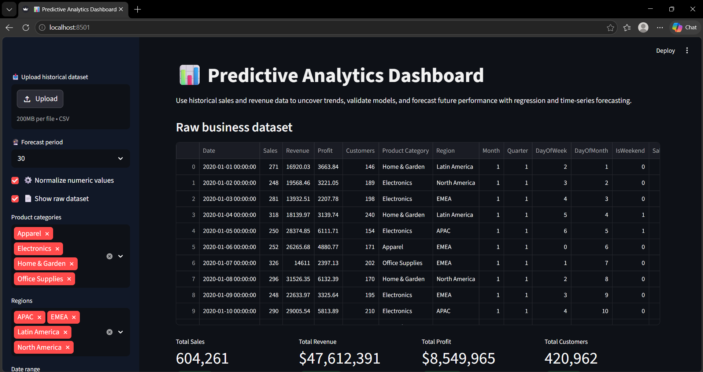
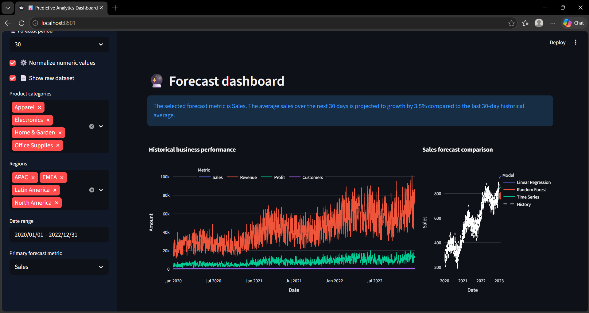
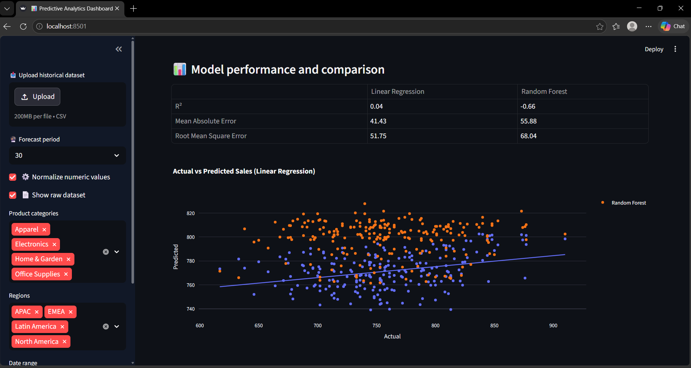
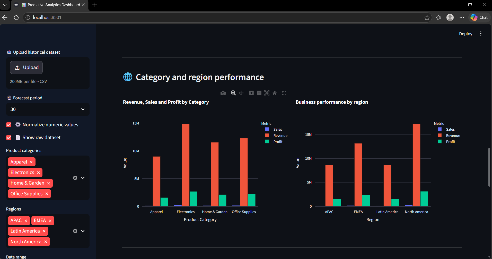
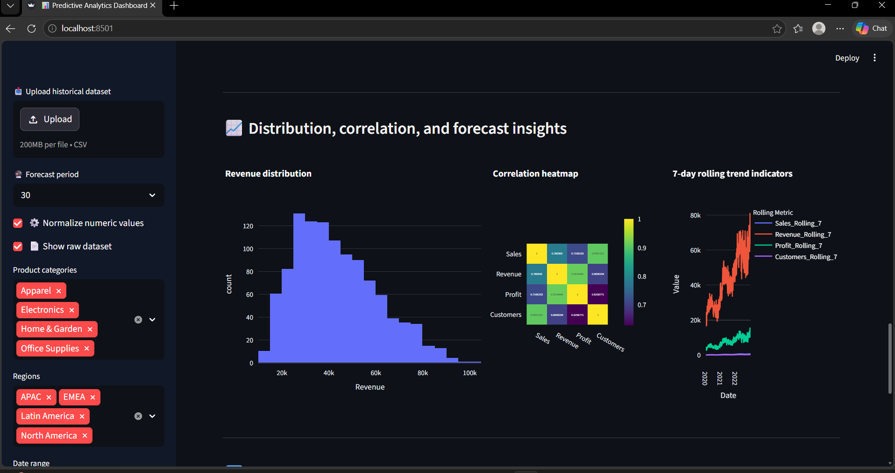
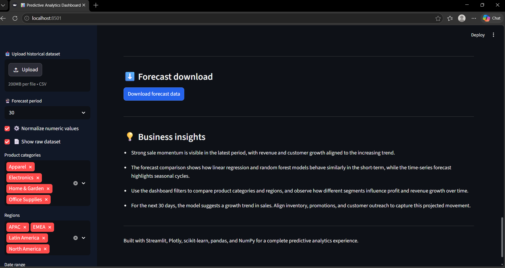

# 📊 Predictive Analytics Dashboard

## 🚀 Project Overview

This project is a professional predictive analytics dashboard built with Python, Streamlit, pandas, NumPy, scikit-learn, Plotly, and Matplotlib. It analyzes historical sales data, cleans and enriches it, trains regression models, and forecasts future performance for revenue, sales, profit, and customer growth.

## ✨ Features

- 📥 Load historical business data from a CSV file
- 🧪 Generate a sample dataset with 1,000+ rows when no file is provided
- 🧹 Clean and preprocess data with missing value handling and duplicate removal
- 🧠 Perform feature engineering with date-based features and rolling metrics
- 📈 Compare Linear Regression and Random Forest models
- 🔮 Generate time-series forecast for 30, 60, and 90-day horizons
- 📊 Display KPI cards, interactive trend charts, forecast comparison, and accuracy metrics
- 🗂️ Filter by product category, region, and date range
- 🔍 Create correlation heatmaps, histograms, scatter plots, and bar charts
- 💾 Download forecasted prediction results as CSV
- 🌙 Modern dark-themed dashboard interface

## Installation

1. Clone or download this repository.
2. Navigate to the project folder in your terminal.
3. Create a Python virtual environment (recommended):

```bash
python -m venv venv
```

4. Activate the virtual environment:

- Windows PowerShell:
  ```powershell
  .\venv\Scripts\Activate.ps1
  ```
- Windows CMD:
  ```cmd
  .\venv\Scripts\activate
  ```

5. Install dependencies:

```bash
pip install -r requirements.txt
```

## Running the Dashboard

Run the Streamlit app from the project directory:

```bash
streamlit run app.py
```

Then open the local URL provided by Streamlit in your browser.

## Project Structure

- `app.py` - Main Streamlit dashboard application
- `sample_historical_data.csv` - Generated historical dataset with sales, revenue, profit, customers, categories, and regions
- `requirements.txt` - Package requirements for the project
- `README.md` - Project documentation and usage instructions

## Predictive Modeling Explanation

This dashboard uses the following modeling techniques:

- **Linear Regression**: Predicts a future metric using numerical date features and seasonal indicators.
- **Random Forest Regressor**: Learns non-linear relationships and interaction effects across date and category features.
- **Time-Series Forecasting**: Uses trend and seasonality from historical dates to project short-term cycles and future values.

Model accuracy is evaluated using:

- **R² Score**
- **Mean Absolute Error (MAE)**
- **Root Mean Square Error (RMSE)**

## Dashboard Usage

1. Use the sidebar to upload your own CSV dataset or work with the sample data.
2. Choose a forecast period: 30, 60, or 90 days.
3. Filter by product categories, regions, and date range.
4. Explore performance charts, model comparisons, and business insights.
5. Download forecast results for your selected prediction.

## Screenshots

### 📊 Dashboard Overview


### 📈 Forecast Trends


### 🔍 Data Analysis


### 📉 Model Comparison


### 💡 Business Insights


### ⬇️ Download Predictions


## Technologies Used

- Python
- Streamlit
- pandas
- NumPy
- scikit-learn
- Plotly
- Matplotlib

## Notes

- If your custom CSV dataset is used, make sure it includes the required columns: `Date`, `Sales`, `Revenue`, `Profit`, `Customers`, `Product Category`, and `Region`.
- The dashboard is designed to be beginner-friendly while showcasing real predictive analytics workflows for business forecasting.
